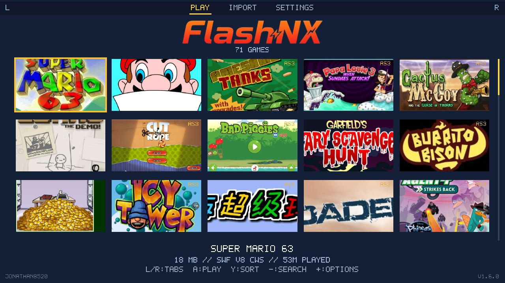
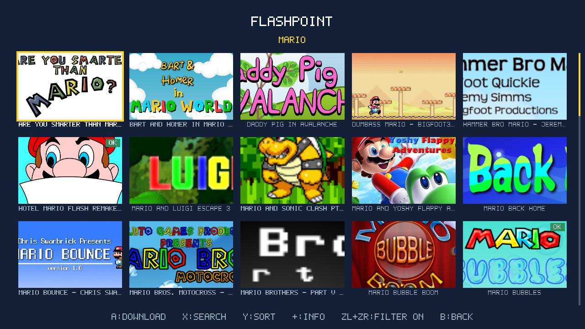
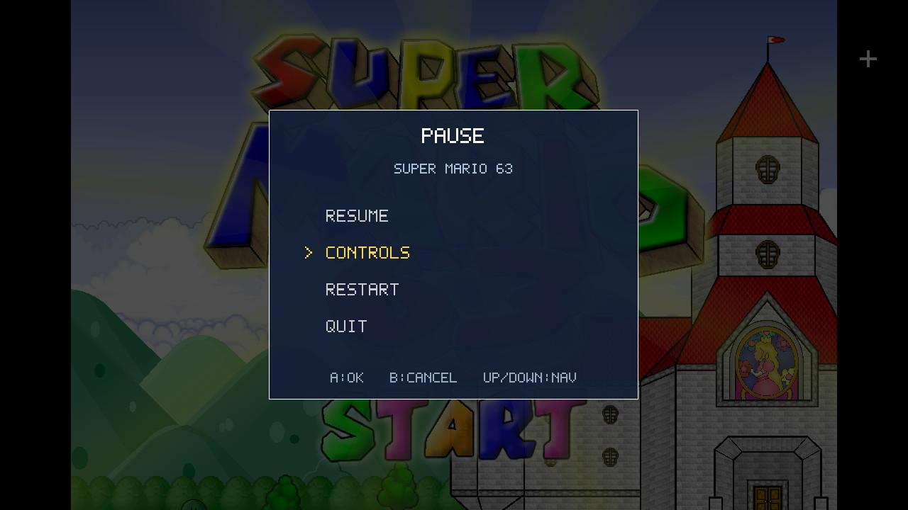
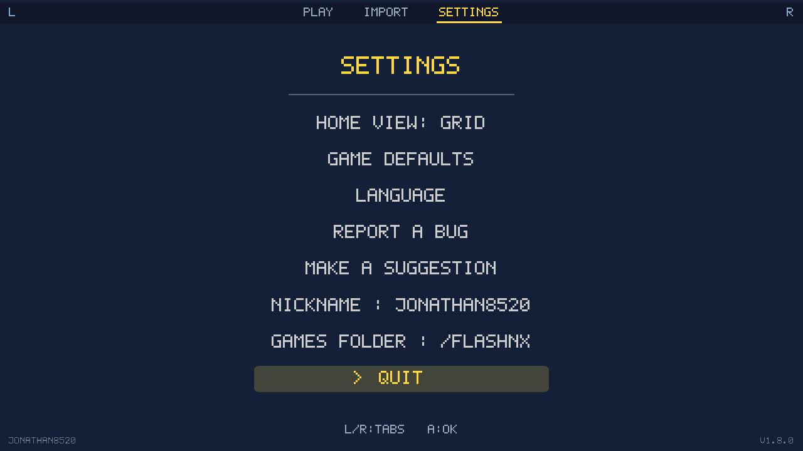

  

  <strong>Homebrew Flash player for Nintendo Switch.</strong> 
  Run your Flash games (<code>.swf</code> — AS1/AS2, and part of AS3) straight from the SD card. 
  Powered by <a href="https://github.com/ruffle-rs/ruffle">Ruffle</a>.

  
  
  
  

> The repo, the toolchain and the Rust crate keep the historical name `flash-for-switch`; **FlashNX** is the application name (what hbmenu and the `.nro` show).

## Overview

| Play | Flashpoint | In game | Settings |
|:---:|:---:|:---:|:---:|
|  |  |  |  |
| Cover gallery, L/R tabs | Download games from Flashpoint | Game + pause menu / key editor | Language, controls, bug report |

## Installation

**Easiest — via the [Homebrew App Store](https://hb-app.store/switch/FlashNX):** open the **hb-appstore** app on your Switch, search for **FlashNX**, install. Updates follow automatically.

**Or manually:**
1. Download **`FlashNX.nro`** from the [Releases](https://github.com/Jonathan8520/FlashNX/releases).
2. Copy it to **`sdmc:/switch/FlashNX/FlashNX.nro`** (the Homebrew Menu also accepts a loose `sdmc:/switch/FlashNX.nro`).

Either way: copy your **`.swf`** files into **`sdmc:/flashnx/`**, then launch **FlashNX** from the Homebrew Menu.

*(Modded Switch with Atmosphère required.)*

## Usage

**In the library**
**L / R** = switch tabs (Play / Import / Settings) · D-pad or sticks = move in the cover gallery · **A** = play · **Y** = sort (name / added / played / size, **X** reverses) · **−** = search (filter by name) · **+** = game options (favorite, controls, rename, cover, delete). Favorites stay pinned to the top of the gallery. Quit, plus bug report and suggestions, from the Settings tab.

**Import tab**
A list of your saved URLs · **A** = launch one · **+ Add a URL** row to enter a new one · **+** on a URL = edit or delete it. Accepts archive.org items and direct `.swf` URLs. **X** searches the **Flashpoint Archive** and downloads a game (cover and real title included; **+** on a result shows its details + download size).

**In game**
Left stick / D-pad = arrows · **A/B/X/Y** = Flash keys (remappable) · right stick = mouse cursor · **ZR** / touch = left click, **ZL** = right click · clicking a text field opens the keyboard · **−** = pause menu. The control editor remaps everything to any Flash key or mouse click, and can turn the right stick into a d-pad (it also covers SL/SR and the stick presses).

- **Cover art**: the library is a grid of covers, 5 per row (cropped to fill). Drop a `<game>.png` or `.jpg` next to the `.swf` to set one, or fetch artwork from the Flashpoint Archive in a game's options (pick from thumbnails).
- **Multi-file games**: some games load companion `.swf` files (a title screen, a minigame, music). When you download a game from the **Flashpoint search (X)**, FlashNX fetches these companions automatically into a `<game>.files/` folder. For a game added another way (URL import, hand-copied), put the companions in that folder yourself (so `Foo.swf` uses `Foo.files/`, and `Foo.swf` loading `top.swf` reads `Foo.files/top.swf`).
- **Home-menu shortcuts**: launch FlashNX with a `.swf` path as its argument and it boots straight into that game (and returns to the Home menu when you quit). With a forwarder tool you can put a single Flash game on your Switch Home menu, with its cover as the icon. **Sphaira** users: FlashNX registers a `.swf` association, so you can select a game in Sphaira's file browser and "Create a Forwarder" → FlashNX.
- **Automatic saves** for games that save (SharedObject `.sol`), on the SD card.
- **Built-in key editor** (48 Flash keys, configurable per game), plus a **global default** layout in the Settings tab.
- **Languages**: English, French, Spanish, Russian, German, Italian, Portuguese, auto-detected from the console's system language, switchable from the Settings tab.

## Tested games

Super Mario 63 · Super Mario World Flash · Mario Forever · Tetris'd · Flappy Bird · Pursuit of Hat 2 · Mario 3D Racing… Most run at 55-60 fps.

## Known limitations

- **Heavy games**: frame-rate drops come from **Ruffle's AVM1/AVM2 interpreter** (CPU-bound, no JIT) — not from our rendering. Out-of-app lever: CPU overclock (sys-clk).
- **AS3 compatibility**: partial, inherited from Ruffle (see [Ruffle compatibility](https://ruffle.rs/compatibility)). AS3 games show a badge in the library.
- **No savestate / rewind**: Ruffle does not expose a snapshot of the execution state. Games' native `.sol` saves do work.
- **Audio**: occasional light crackle on *very* dense scenes (to be refined).

## Credits & licenses

FlashNX is only a **Switch integration layer** on top of remarkable projects — all credit for the Flash emulation goes to **Ruffle**.

**Core**
- **[Ruffle](https://github.com/ruffle-rs/ruffle)** — *Apache-2.0 / MIT* — Flash engine (SWF parsing + AVM1/AVM2 interpreter). FlashNX embeds `ruffle_core`, `ruffle_render`, `swf`.
- **[devkitPro](https://devkitpro.org/) / libnx** — *ISC* — Switch toolchain + Horizon API (audio **audren**, input **hid**, threads, exception handler).
- **[switch-mesa](https://github.com/devkitPro/pacman-packages)** — *MIT* — OpenGL/GLES via Nouveau, the graphics backend.

**Game & cover data**
- **[Flashpoint Archive](https://flashpointarchive.org/)**: the Flash game preservation project. FlashNX uses its public APIs (search, logos, GameZIPs) so you can find cover art and download the games you choose. All preserved games stay the property of their original creators, and FlashNX only fetches what you explicitly request.

**Network (archive.org import over HTTPS)**
- [libcurl](https://curl.se/) · [Mbed-TLS](https://github.com/Mbed-TLS/mbedtls) · [zlib](https://zlib.net/) · [Mozilla](https://curl.se/docs/caextract.html) CA certificate bundle.

**Rust libraries**
- [jpeg-decoder](https://github.com/image-rs/jpeg-decoder) (fork patched for newlib) · `png` · `serde` / `serde_json` · `tracing` · `flate2` · `getrandom` · + Ruffle's transitive dependencies (`gc-arena`, `dasp`…).

**Acknowledgements** — Switch homebrew ecosystem projects consulted during the port's R&D (no code reused): [ScummVM](https://www.scummvm.org/) (`OSystem` port pattern), the PPSSPP Switch port (switch-mesa GL reference), [Tico](https://github.com/ticohq/tico), [dawn-switch](https://github.com/dantiicu/dawn-switch) *(the WebGPU alternative we evaluated)*, and the devkitPro / GBAtemp community.

**License**: the FlashNX integration code is distributed under the **MIT** license (see [`LICENSE`](LICENSE)). Ruffle and the other dependencies keep their respective licenses.

---

📖 **Architecture, build & technical notes** → [DEVELOPMENT.md](DEVELOPMENT.md)
📦 **Changelog** → [CHANGELOG.md](CHANGELOG.md)
