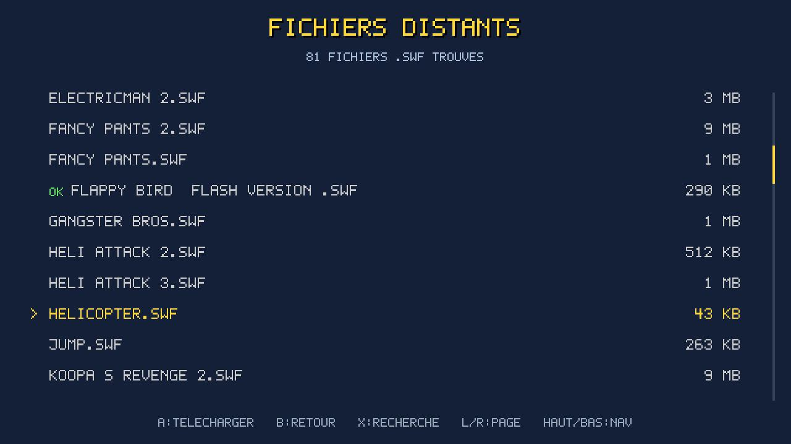

  

  <strong>Homebrew Flash player for Nintendo Switch.</strong> 
  Run your Flash games (<code>.swf</code> — AS1/AS2, and part of AS3) straight from the SD card. 
  Powered by <a href="https://github.com/ruffle-rs/ruffle">Ruffle</a>.

  
  
  
  

> The repo, the toolchain and the Rust crate keep the historical name `flash-for-switch`; **FlashNX** is the application name (what hbmenu and the `.nro` show).

## Overview

| Library | Remote import | In game |
|:---:|:---:|:---:|
|  |  |  |
| Joycon navigation, banner + color chip, AS3 badge | HTTPS `.swf` download from archive.org | Game + pause menu / key editor |

## Installation

**Easiest — via the [Homebrew App Store](https://hb-app.store/switch/FlashNX):** open the **hb-appstore** app on your Switch, search for **FlashNX**, install. Updates follow automatically.

**Or manually:**
1. Download **`FlashNX.nro`** from the [Releases](https://github.com/Jonathan8520/FlashNX/releases).
2. Copy it to **`sdmc:/switch/FlashNX/FlashNX.nro`** (the Homebrew Menu also accepts a loose `sdmc:/switch/FlashNX.nro`).

Either way: copy your **`.swf`** files into **`sdmc:/flashnx/`**, then launch **FlashNX** from the Homebrew Menu.

*(Modded Switch with Atmosphère required.)*

## Usage

**In the library**
Up/down (D-pad or sticks) = navigate · **A** = play · **X** = search (filter by name) · **ZL** = options (controls, rename, delete) · **Y** = import from archive.org · **+** = settings (default controls, language) · **−** = quit.

**In game**
Left stick / D-pad = arrows · **A/B/X/Y** = Flash keys (remappable) · right stick = mouse cursor · **ZR** / touch = click · **−** = pause menu.

- **Automatic saves** for games that save (SharedObject `.sol`), on the SD card.
- **Built-in key editor** (48 Flash keys, configurable per game) — and a **global default** layout in the settings.
- **Languages**: English, French, Spanish, Russian — auto-detected from the console's system language, switchable from the settings (**+**).

## Tested games

Super Mario 63 · Super Mario World Flash · Mario Forever · Tetris'd · Flappy Bird · Pursuit of Hat 2 · Mario 3D Racing… Most run at 55-60 fps.

## Known limitations

- **Heavy games**: frame-rate drops come from **Ruffle's AVM1/AVM2 interpreter** (CPU-bound, no JIT) — not from our rendering. Out-of-app lever: CPU overclock (sys-clk).
- **AS3 compatibility**: partial, inherited from Ruffle (see [Ruffle compatibility](https://ruffle.rs/compatibility)). AS3 games show a badge in the library.
- **No savestate / rewind**: Ruffle does not expose a snapshot of the execution state. Games' native `.sol` saves do work.
- **Audio**: occasional light crackle on *very* dense scenes (to be refined).

## Credits & licenses

FlashNX is only a **Switch integration layer** on top of remarkable projects — all credit for the Flash emulation goes to **Ruffle**.

**Core**
- **[Ruffle](https://github.com/ruffle-rs/ruffle)** — *Apache-2.0 / MIT* — Flash engine (SWF parsing + AVM1/AVM2 interpreter). FlashNX embeds `ruffle_core`, `ruffle_render`, `swf`.
- **[devkitPro](https://devkitpro.org/) / libnx** — *ISC* — Switch toolchain + Horizon API (audio **audren**, input **hid**, threads, exception handler).
- **[switch-mesa](https://github.com/devkitPro/pacman-packages)** — *MIT* — OpenGL/GLES via Nouveau, the graphics backend.

**Network (archive.org import over HTTPS)**
- [libcurl](https://curl.se/) · [Mbed-TLS](https://github.com/Mbed-TLS/mbedtls) · [zlib](https://zlib.net/) · [Mozilla](https://curl.se/docs/caextract.html) CA certificate bundle.

**Rust libraries**
- [jpeg-decoder](https://github.com/image-rs/jpeg-decoder) (fork patched for newlib) · `png` · `serde` / `serde_json` · `tracing` · `flate2` · `getrandom` · + Ruffle's transitive dependencies (`gc-arena`, `dasp`…).

**Acknowledgements** — Switch homebrew ecosystem projects consulted during the port's R&D (no code reused): [ScummVM](https://www.scummvm.org/) (`OSystem` port pattern), the PPSSPP Switch port (switch-mesa GL reference), [Tico](https://github.com/ticohq/tico), [dawn-switch](https://github.com/dantiicu/dawn-switch) *(the WebGPU alternative we evaluated)*, and the devkitPro / GBAtemp community.

**License**: the FlashNX integration code is distributed under the **MIT** license (see [`LICENSE`](LICENSE)). Ruffle and the other dependencies keep their respective licenses.

---

📖 **Architecture, build & technical notes** → [DEVELOPMENT.md](DEVELOPMENT.md)
📦 **Changelog** → [CHANGELOG.md](CHANGELOG.md)
